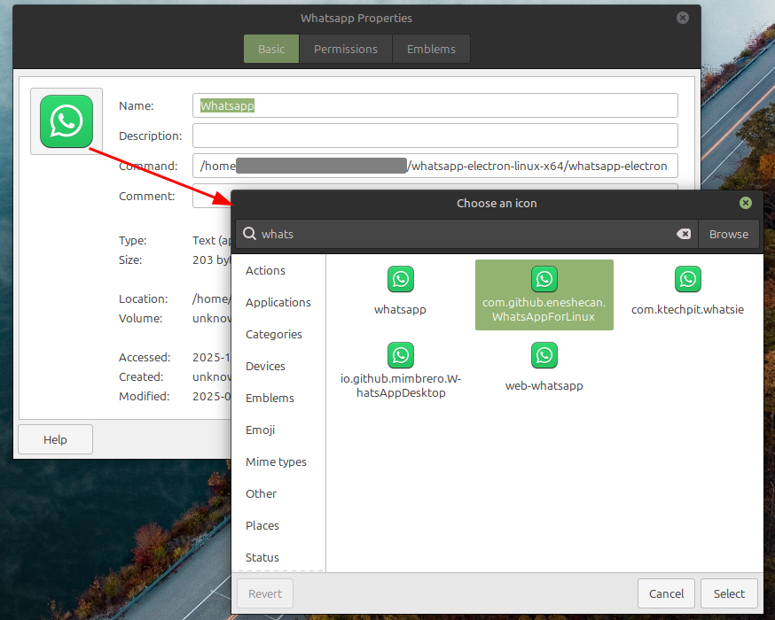

# whatsapp-linux
WhatsApp hosted as an app via Electron

To build run `./build.sh` the app is the entire `whatsapp-electron-linux-x64` output in the `src` folder.

Main window  

Context menu with spell check  

The Desktop icon is just simple Linux Launcher icon. In case of Linux Mint the icon is provided with the OS.  

"Start menu" would be a similar concept. In both cases you need to select the location where you keep the application.