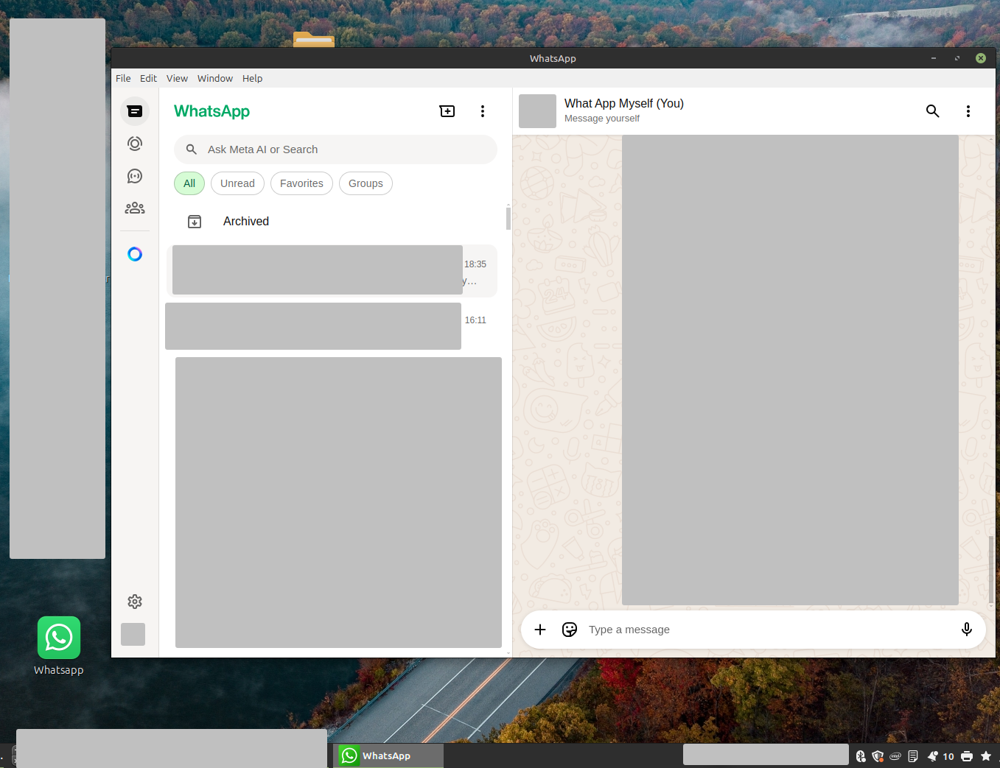
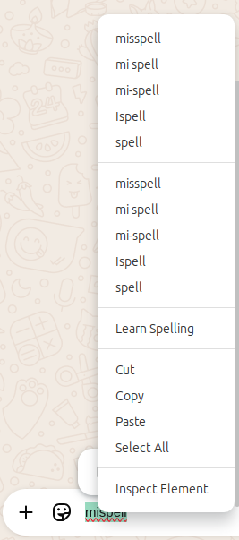

# whatsapp-linux
WhatsApp hosted as an app via Electron

To build run `./build.sh` the app is the entire `whatsapp-electron-linux-x64` output in the `src` folder.

Main window        

Context menu with spell check
